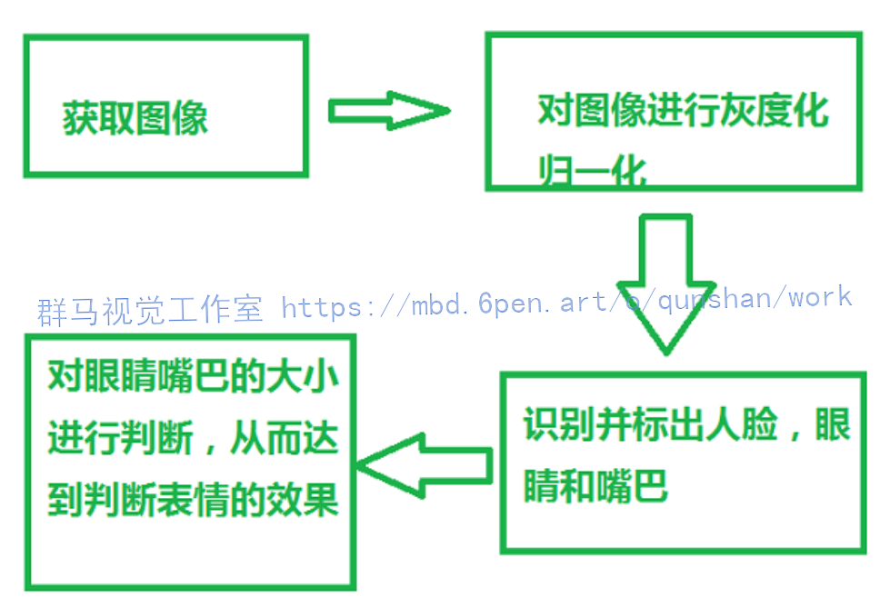

# 1.项目背景
人脸表情识别是模式识别中一个非常重要却十分复杂的课题。首先对计算机人脸表情识别技术的研究背景及发展历程作了简单回顾。然后对近期人脸表情识别的方法进行了分类综述。通过对各种识别方法的分析与比较 ,提出了人脸表情识别技术实用化所需要考虑的几个方面 ,进而展望了今后人脸表情识别技术的发展方向。 

# 2.识别效果展示


# 3.识别视频演示
[Python基于OpenCV的人脸表情识别系统[源码＆部署教程]_哔哩哔哩_bilibili](https://www.bilibili.com/video/BV11P41137Wv?spm_id_from=333.999.0.0&vd_source=bc9aec86d164b67a7004b996143742dc)


# 4.实现方法分析
人脸表情识别中需要运用人脸检测技术，识别人脸之后，再对表情图像做预处理（彩色图像灰度化、图像几何归一化和光照预处理），然后再对表情特征进行提取，分析，从而实现对表情的识别。国内外对于人脸的表情识别的研究近几年非常的多，涌现出了很多的算法，但对于表情的识别精度还是有待改进。

# 5.实现方法分析
人脸表情识别中需要运用人脸检测技术，识别人脸之后，再对表情图像做预处理（彩色图像灰度化、图像几何归一化和光照预处理），然后再对表情特征进行提取，分析，从而实现对表情的识别。国内外对于人脸的表情识别的研究近几年非常的多，涌现出了很多的算法，但对于表情的识别精度还是有待改进。
[参考该博客的方法](https://mbd.pub/o/bread/Y5WcmZhq)，本设计采用人脸检测技术，并进行标记，图像灰度化，图像几何归一化等方法，通过提取出嘴巴，眼睛两个地方的大小变化进行判断。

# 5.算法流程图



# 6.fer2013人脸表情数据集简介
Fer2013人脸表情数据集由35886张人脸表情图片组成，其中，测试图（Training）28708张，公共验证图（PublicTest）和私有验证图（PrivateTest）各3589张，每张图片是由大小固定为48×48的灰度图像组成，共有7种表情，分别对应于数字标签0-6，具体表情对应的标签和中英文如下：0 anger 生气； 1 disgust 厌恶； 2 fear 恐惧； 3 happy 开心； 4 sad 伤心；5 surprised 惊讶； 6 normal 中性。

但是，数据集并没有直接给出图片，而是将表情、图片数据、用途的数据保存到csv文件中，如下图所示，

如上图所示，第一张图是csv文件的开头，第一行是表头，说明每列数据的含义，第一列表示表情标签，第二列即为图片数据，这里是原始的图片数据，最后一列为用途。

# 7.表情图片提取
[按照该博客的数据结构存放数据集](https://afdian.net/item?plan_id=10ac941a631511edb8eb52540025c377)，使用pandas解析csv文件，(pandas的简单用法可以查看这篇博客：https://blog.csdn.net/rookie_wei/article/details/82974277 )，再将原始图片数据保存为jpg文件，并根据用途和标签标签进行分类，分别保存到对应文件夹下，代码比较简单，并且做了详细备注，直接给完整代码如下

#### 代码实现
```
#encoding:utf-8
import pandas as pd
import numpy as np
import scipy.misc as sm
import os
 
emotions = {
    '0':'anger', #生气
    '1':'disgust', #厌恶
    '2':'fear', #恐惧
    '3':'happy', #开心
    '4':'sad', #伤心
    '5':'surprised', #惊讶
    '6':'normal', #中性
}
 
#创建文件夹
def createDir(dir):
    if os.path.exists(dir) is False:
        os.makedirs(dir)
 
def saveImageFromFer2013(file):
 
 
    #读取csv文件
    faces_data = pd.read_csv(file)
    imageCount = 0
    #遍历csv文件内容，并将图片数据按分类保存
    for index in range(len(faces_data)):
        #解析每一行csv文件内容
        emotion_data = faces_data.loc[index][0]
        image_data = faces_data.loc[index][1]
        usage_data = faces_data.loc[index][2]
        #将图片数据转换成48*48
        data_array = list(map(float, image_data.split()))
        data_array = np.asarray(data_array)
        image = data_array.reshape(48, 48)
 
        #选择分类，并创建文件名
        dirName = usage_data
        emotionName = emotions[str(emotion_data)]
 
        #图片要保存的文件夹
        imagePath = os.path.join(dirName, emotionName)
 
        # 创建“用途文件夹”和“表情”文件夹
        createDir(dirName)
        createDir(imagePath)
 
        #图片文件名
        imageName = os.path.join(imagePath, str(index) + '.jpg')
 
        sm.toimage(image).save(imageName)
        imageCount = index
    print('总共有' + str(imageCount) + '张图片')
 
 
if __name__ == '__main__':
    saveImageFromFer2013('fer2013.csv')
```
运行完上面的代码后，得到3个文件夹，文件下有相应的表情的子文件夹

子文件夹下又有相应的图片


# 8.系统整合
下图[完整源码&环境部暑视频教程&数据集&自定义UI界面](https://s.xiaocichang.com/s/8a952d)

参考博客[《Python基于OpenCV的人脸表情识别系统\[源码＆部署教程\]》](https://mbd.pub/o/qunma/work)


# 9.参考文献
*   *[1]*[人工心理模型驱动的人脸表情动画合成](https://kns.cnki.net/kcms/detail/detail.aspx?filename=JSGG200808031&dbcode=CJFD&dbname=CJFD2008&v=hfIEJ226jPUARClPcGeYSjs0ebxfV4X8Ofiopo3ozEV3HJd2m0IlosBklpCUqIUp)[J]. 谷学静,许广宾,熊伟,王志良.  计算机工程与应用. 2008(08)
*   *[2]*[基于CNN的人脸识别解压助眠微信小程序](https://kns.cnki.net/kcms/detail/detail.aspx?filename=DNBC202208027&dbcode=CJFD&dbname=CJFDTEMP&v=Ux3QKFI6nrQjzIqyhqy9M5f8KdAGQZz_WOlQczIHwzsbry8aBGAgypcxLlHzCEE2)[J]. 胡文寒,李健喆,曾天伦,沈青.  电脑编程技巧与维护. 2022(08)
*   *[3]*[小波变换在人脸表情识别研究中的应用](https://kns.cnki.net/kcms/detail/detail.aspx?filename=CGJM201103038&dbcode=CJFD&dbname=CJFD2011&v=Z2M0tAQIWLZq2kY1XPlbtsRDXfDc1dSI4sgYt56BlZ-o4t0-tPvhD7lHH8g8sQFK)[J]. 崔景霞.  长春理工大学学报(自然科学版). 2011(03)
*   *[4]*[基于活动外观模型的人脸表情分析与识别](https://kns.cnki.net/kcms/detail/detail.aspx?filename=GDZJ200407025&dbcode=CJFD&dbname=CJFD2004&v=aCxIaWZuEF7z_FYYNn5rMJZRfxXTDlX3ohA4WcieRa5wenK4OW2bfGeEYocfKR_d)[J]. 左坤隆,刘文耀.  光电子·激光. 2004(07)
*   *[5]*[人脸表情识别方法综述](https://kns.cnki.net/kcms/detail/detail.aspx?filename=ZJTG200916095&dbcode=CJFD&dbname=CJFD2009&v=pcQp3msuBMAPJOF0g_G1EXhE5y-ZitQAqtIk0DNEoRLsVzP9aZUE8cMU1Nqe6v2P)[J]. 陈俊.  中国集体经济. 2009(16)
*   *[6]*[基于语义属性的人脸表情识别新方法](https://kns.cnki.net/kcms/detail/detail.aspx?filename=XXWX201602029&dbcode=CJFD&dbname=CJFD2016&v=y-yLmg8NQEUBTCiJik4kZuV05uu2fG4-5jKC7_3g4CyYq3E_YUp6KtdE1GuvpcAW)[J]. 于永斌,刘清怡,毛启容,詹永照.  小型微型计算机系统. 2016(02)
*   *[7]*[人脸表情特征提取方法的研究进展](https://kns.cnki.net/kcms/detail/detail.aspx?filename=CGGL200806030&dbcode=CJFD&dbname=CJFD2008&v=VvL_xbFjGLwS6B2wPS5P2fK3-ihXzOHBYz8JInpcFS8a3pPDThTmNQS2RWZqq5zI)[J]. 乔明,陈亚军.  重庆工学院学报(自然科学版). 2008(06)
*   *[8]*[人脸表情自动识别技术研究进展](https://kns.cnki.net/kcms/detail/detail.aspx?filename=XNJT200503000&dbcode=CJFD&dbname=CJFD2005&v=F8XP0G-jlOiaWBU00Jo7cqa-_c1W_WW6aLY32W3oqPAUH2Dv1K2339N0COnpLChC)[J]. 张家树,陈辉,李德芳,罗小宾,夏小东.  西南交通大学学报. 2005(03)
*   *[9]*[基于多群体遗传算法的人脸表情识别](https://kns.cnki.net/kcms/detail/detail.aspx?filename=HXDY201301013&dbcode=CJFD&dbname=CJFD2013&v=QjcAahei8TbMWpr0i5VfT6YILmvSknOmTeLymfQjC4EVF4pM_XpYScbpIiixYyS4)[J]. 朱娅妮,吴国华,杜加友.  杭州电子科技大学学报. 2013(01)
*   *[10]*[基于生成对抗网络的人脸表情数据增强方法](https://kns.cnki.net/kcms/detail/detail.aspx?filename=JSGG202004018&dbcode=CJFD&dbname=CJFD2020&v=UVJbamaWiqPg5yQhu8St0BiUjNCl2H1tySEox6u7Sgh-FZILzOO04oiIdaq0WuF3)[J]. 孙晓,丁小龙.  计算机工程与应用. 2020(04)


---
#### 如果您需要更详细的【源码和环境部署教程】，除了通过【系统整合】小节的链接获取之外，还可以通过邮箱以下途径获取:
#### 1.请先在GitHub上为该项目点赞（Star），编辑一封邮件，附上点赞的截图、项目的中文描述概述（About）以及您的用途需求，发送到我们的邮箱
#### sharecode@yeah.net
#### 2.我们收到邮件后会定期根据邮件的接收顺序将【完整源码和环境部署教程】发送到您的邮箱。
#### 【免责声明】本文来源于用户投稿，如果侵犯任何第三方的合法权益，可通过邮箱联系删除。